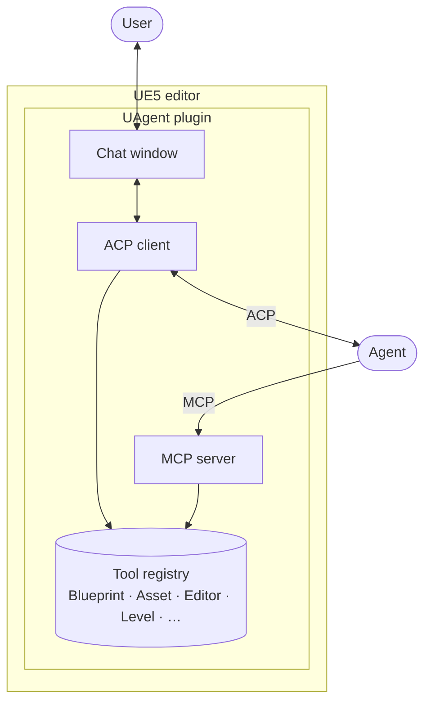
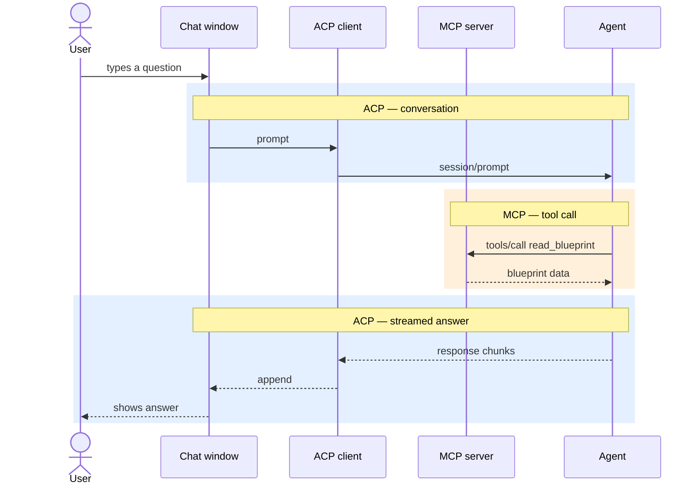

# Contributing to UAgent

## Architecture

Four components inside the plugin, two external things that talk to it:



- **Chat window** — the user's surface. In-editor Slate tab.
- **ACP client** — runs the chat loop with a spawned **Agent** subprocess (Claude via the `claude-agent-acp` adapter, or any other ACP agent).
- **MCP server** — HTTP endpoint (`http://127.0.0.1:47777/mcp`) that exposes tools to *any* MCP client, including external ones that have nothing to do with the chat tab.
- **Tool registry** — the single source of truth for everything the editor can do for an agent. Both ACP inbound requests and MCP `tools/call` dispatch through it, so every tool is one `IACPTool` implementation and both protocols see it.

### Runtime flow — why both ACP and MCP

ACP carries the conversation. MCP carries tool calls. A single user turn crosses both:



MCP is the tool-discovery channel: off-the-shelf agents (Claude Code, Claude Desktop, Cursor, Zed) don't have UE5 tools baked in; they have to call `tools/list` on an MCP server to learn what's available. ACP's extension methods (`_ue5/*`) are callable but not discoverable, so the MCP server exposes the same tools under their bare names (`read_blueprint`, `create_node`, `link_nodes`).

## Adding a new tool

Drop `Private/Tools/<Group>/MyTool.cpp` defining a class `: public IACPTool` (in an anonymous namespace inside `namespace UAgent { ... }`) plus a `TSharedRef<IACPTool> CreateMyTool()` factory; forward-declare the factory in `Tools/BuiltinTools.h`; add one `Registry.Register(CreateMyTool())` line in `BuiltinTools.cpp`. The class must override `GetMethod()` *and* `IsReadOnly()` — both are pure virtual, so the build fails if either is missing (see [Permission classification](#permission-classification) below). No edits to `FACPClient`, `FMCPServer`, or any UI code. Add the user-facing one-liner to [TOOLS.md](TOOLS.md) in the matching section.

### Tool shape: intent over API

Tools are **intent-shaped** by default — the name describes what the agent wants, and the tool figures out which engine code path applies. `set_component_property` dispatches to an SCS template *or* a live actor instance based on the path. `save_asset` covers asset-by-path, the active level, or all dirty levels under one verb. The agent should not have to learn the editor's internal model to call a tool correctly.

Carve out a dedicated tool only when one of these is true:

- **A typed engine helper makes the call meaningfully more correct than the generic write.** `set_component_material` exists alongside `set_component_property` because `UMeshComponent::SetMaterial` does more than poke `OverrideMaterials`, and template propagation requires `PropagateDefaultValueChange<TArray<TObjectPtr<UMaterialInterface>>>` — typed at compile time, unreachable from the FProperty-generic dispatch.
- **The intent is a coherent feature with opinionated wiring.** `create_material` wires scalar constants into BaseColor/Emissive/Metallic/Roughness/Specular; `create_gameplay_tag` does INI surgery. The agent's intent is "make this thing exist," not "perform N reflection writes."
- **The target surface is genuinely different.** `set_default_value` (variable defaults / CDO) and `set_component_property` (component templates / live components) operate on different parts of a Blueprint; collapsing them would force the agent to specify which surface up front.

Skip the carve-out when the only difference is the value of a parameter, or when "convenience" is the only justification — extend the generic tool's signature instead. 1:1 thin wrappers around a single engine call (`compile_blueprint`, `run_console_command`) are fine when that call *is* the agent's intent.

### Permission classification

`IACPTool::IsReadOnly()` is **pure virtual** — every tool must explicitly classify itself or the build fails. Drop the override right under `GetMethod()`:

```cpp
// Read tool — only queries state, never mutates:
virtual bool IsReadOnly() const override { return true; }

// Mutating tool — creates, modifies, or deletes anything:
virtual bool IsReadOnly() const override { return false; }
```

Pure-virtual: every tool must classify itself. See `CreateBlueprintTool.cpp` (mutating) and `ListAssetsTool.cpp` (read-only) for the pattern.

What this drives:
- **Permission gating.** `RequestPermissionTool` looks the tool up by name in the registry and consults `IsReadOnly()`. Read Only auto-allows read tools / auto-rejects mutating ones; Default auto-allows reads and prompts the user via the chat permission card on mutations.
- **MCP `annotations.readOnlyHint`.** `FMCPServer` emits this in `tools/list` for read-only tools so any spec-respecting external MCP client (Claude Desktop, Cursor, Zed) can also classify them. `claude-agent-acp` itself currently ignores annotations, so the in-process registry lookup is what actually gates the chat tab.

If a tool only ever changes ephemeral editor UI state (focus, opening a window) and never touches saved data, it counts as read-only — see `OpenAssetTool` and `FocusInContentBrowserTool` for the precedent. Anything that writes a file, dirties an asset, edits a property, or modifies a level counts as mutating — including writing scratch artifacts under `Saved/` (e.g. `capture_viewport`'s PNG output).

#### Runtime: how a request gets answered

`session/request_permission` is handled by `FRequestPermissionTool` (in `Tools/Session/`), which reads the chat window's selected mode and the tool's `IsReadOnly()` and decides:

- **Full Access** — always picks `allow_once` (or `allow_always` as fallback) from the agent's `options[]` and returns synchronously.
- **Read Only** — picks `allow_once` for read-only tools, `reject_once` otherwise. Synchronous.
- **Default** — read-only tools auto-allow; mutating tools defer via `FPermissionBroker::Get().Request(...)`. The broker hands the request to the chat window, which appends a permission card to the transcript and stores the completion callback. When the user clicks Accept/Cancel, the chat resolves the callback and the tool's `ExecuteAsync` continuation echoes the matching `optionId` back to the agent.

Because `Default` mode has to wait on user input, `IACPTool::ExecuteAsync` exists alongside `Execute` — its default implementation just forwards to `Execute` synchronously, but tools that need to defer override it. `FACPClient::HandleRequest` always dispatches via `ExecuteAsync` and captures the tool by shared-ref so it survives the deferral.

The MCP-tool kind heuristic in `FRequestPermissionTool` (looking up the `_ue5/<name>` tool in the registry by name) only matters because `claude-agent-acp` 0.31.0 always tags MCP tools `kind="other"`. Any spec-respecting agent that reads our `annotations.readOnlyHint` and emits a real `kind` will be classified by `kind` directly without the registry round-trip.

### Shared helpers (`UAgent::Common`, in `Private/Tools/Common/`)

Reach for these before hand-rolling equivalents:

- **`AssetPathUtils.h`** — content-browser path handling. Agents pass paths in three shapes (`/Game/X/Y`, `/Game/X/Y.Y`, `/Game/X/Y.Y_C`); naive engine APIs only accept one.
  - `LoadAssetByPath(path, expectedClass, outError)` — the default way to resolve an agent-supplied asset path to a `UObject*`. Normalizes, calls `StaticLoadObject`, type-checks.
  - `NormalizeAssetPath(path)` — returns the `Package.Object` form. Use when you need the path as a string (e.g. passing to `UEditorAssetLibrary`).
  - `SplitContentPath(path, outPkg, outName, outError)` — returns the package-only form (`/Game/X/Y`) and the terminal name. **This is the canonical way to get the argument for `SaveAsset`** — don't reinvent the `FindChar('.')` + `Left(Dot)` dance inline.
- **`ClassResolver.h::ResolveClass`** — turns any of `"Character"`, `"ACharacter"`, `"/Script/Engine.Character"`, or `"/Game/Foo/BP.BP_C"` into a `UClass*`. Use whenever a tool accepts a class-name parameter from an agent.
- **`PropertyToJson.h`** — reflection-walking serializers used by `read_*` and `get_*_properties` tools (`PropertyValueToJson`, `PropertiesToJsonObject`, `PropertyTypeToJson`). If you're emitting FProperty values into a tool response, use these instead of building JSON by hand — they already handle the container/struct/object-ref cases consistently.

### Mutation hygiene

Three rules that every mutating tool has to follow, and that are easy to omit silently — the mutation appears to work in the editor but doesn't persist, doesn't render, or doesn't round-trip through compile:

1. **After any structural Blueprint change, call `FKismetEditorUtilities::CompileBlueprint(BP)`.** Applies to graph edits, variable/function/interface adds, and any SCS/component-template write. Without it the editor UI stays stale, the CDO isn't rebuilt, and placed-instance reinstancing never runs. Pair with `FBlueprintEditorUtils::MarkBlueprintAsModified(BP)` *unless* you used an engine helper that marks internally (`AddMemberVariable`, `AddInterface`, etc. — check the helper's implementation; when in doubt, mark).
2. **After `FProperty::ImportText_Direct`, fire `PostEditChangeProperty`.** Raw `ImportText_Direct` only writes bytes. The engine's rebuild hooks — material recompile, `SceneComponent::OnRegister`, details-panel notifications, asset-dirty flags — only run when `PostEditChangeProperty(FPropertyChangedEvent(Prop, EPropertyChangeType::ValueSet))` is called on the owning object. Skipping it is the most common way a "why isn't my change visible?" bug happens.
3. **Pass the package path to `SaveAsset`, not the object path.** `/Game/Foo/Bar`, not `/Game/Foo/Bar.Bar`. Use `Common::SplitContentPath` rather than hand-stripping the dot.

### Writing a tool that mutates a Blueprint component template

**Rule:** any tool that takes `blueprintPath` + `componentName`, resolves `USCS_Node::ComponentTemplate`, and writes a property on the template **must** propagate the change to placed-actor instances of that Blueprint — otherwise the subsequent `CompileBlueprint` silently reverts the change on every already-placed actor.

Why it happens: the reinstancer copies **per-instance** property state old→new as part of class reinstancing. An instance that was "inheriting" the template's prior default (e.g. `OverrideMaterials=[]`) keeps that prior value, which overwrites the new template default on the new instance. The details panel avoids this by calling `FComponentEditorUtils::PropagateDefaultValueChange<T>` immediately after each template write; programmatic tools have to do the same.

Expose this as an optional `propagate` boolean parameter, default **true**, so callers can opt out for bulk-prototyping workflows where re-dirtying every level for each template write is undesirable. When omitted, the tool matches the details-panel behavior users expect.

Recipe (for a tool with a single known property type `T`):

```cpp
// Before mutation — snapshot the template's current value.
const T OldValue = Template->Field;

FScopedTransaction Tx(LOCTEXT("MyTx", "..."));
BP->Modify();
Node->Modify();
Template->Modify();
/* mutate the template — setter, or direct write + PostEditChangeProperty */;

const T NewValue = Template->Field;

FProperty* Prop = FindFProperty<FProperty>(
    Template->GetClass(),
    GET_MEMBER_NAME_CHECKED(TemplateClass, Field));
check(Prop);

TSet<USceneComponent*> UpdatedInstances;
FComponentEditorUtils::PropagateDefaultValueChange<T>(
    Template, Prop, OldValue, NewValue, UpdatedInstances);

FBlueprintEditorUtils::MarkBlueprintAsModified(BP);
FKismetEditorUtilities::CompileBlueprint(BP);
// Consider returning UpdatedInstances.Num() in the response.
```

Worked example: `Source/UAgent/Private/Tools/Blueprint/SetComponentMaterialTool.cpp` (T = `TArray<TObjectPtr<UMaterialInterface>>`, property = `OverrideMaterials`).

**FProperty-generic tools** (`set_component_property` and friends): the property type isn't known at compile time, so the templated engine helper isn't usable. Those tools need a hand-rolled loop walking `Template->GetArchetypeInstances(...)`, using `FProperty::Identical` to compare each instance to the old default and `FProperty::CopyCompleteValue` to write the new one — mirroring what `ApplyDefaultValueChange` does internally. Snapshot the old value into a heap buffer (`FMemory::Malloc` + `Prop->InitializeValue` + `Prop->CopyCompleteValue`, released via `ON_SCOPE_EXIT` calling `Prop->DestroyValue` + `FMemory::Free`) so `Identical` has a stable reference to compare against. `Prop->Identical` and `CopyCompleteValue` route through each property's own implementation, so bool bitfields are handled correctly without a separate specialization. Worked example: `Source/UAgent/Private/Tools/Blueprint/SetComponentPropertyTool.cpp`.

Do not try to route this through `FBlueprintEditorUtils::PostEditChangeBlueprintActors` or a compile-flag: the former is too coarse (actor-level `PostEditChange`, not property-level), and no compile flag exists that forces template→instance sync for already-placed actors.

## Code style

C++ is formatted with `clang-format` against the `.clang-format` at the repo root (`BasedOnStyle: LLVM`). Before sending a PR:

- Run `Format.ps1` at the repo root to format every tracked C/C++ file in place (requires `clang-format` on `PATH`).
- Or format selectively with `clang-format -i --style=file <files>`.

The `clang-format` GitHub Action (`.github/workflows/clang-format.yml`) re-checks changed files on every PR with `--dry-run --Werror`, so an unformatted file will fail CI.

## Key flow on `New Session`

1. `SACPChatWindow::StartSession` reads `UUAgentSettings`.
2. `FACPClient::Start` constructs `FACPTransport`, spawns the configured `AgentCommand` (typically the `claude-agent-acp` shim, which itself launches node) via `FPlatformProcess::CreateProc` with stdin/stdout/stderr pipes.
3. A background `FRunnable` accumulates stdout bytes, splits on `\n`, parses each line as `FJsonObject`, enqueues onto an MPSC queue.
4. `FTSTicker` on the game thread drains the queue and fires `OnMessage` to `FACPClient::HandleIncoming`. Response callbacks and `session/update` notifications go to their own handlers; agent→client requests are looked up in `FACPToolRegistry` by `method` and delegated to the matching `IACPTool::ExecuteAsync` (which forwards to the synchronous `Execute` for tools that don't need to defer — see [Permission classification](#permission-classification)).
5. `FACPClient` sends `initialize` with `clientCapabilities.fs.{readTextFile,writeTextFile}` derived from whether those tools are registered, reads `agentCapabilities.mcpCapabilities.http` from the response, then `session/new` with `cwd = FPaths::ProjectDir()` and an `mcpServers` array containing the in-editor HTTP MCP server (only when the agent advertises HTTP support and the chat window passed a URL via `SetMcpServerUrl`).
6. The `session/new` response can include `configOptions` — agent-advertised typed selectors (Claude exposes a `model` category). They're parsed into `FConfigOption` and held on the client; the chat window subscribes to `OnAgentSettingsChanged` and surfaces `category == "model"` entries as a **Model:** dropdown next to the permission-mode dropdown. Picking a value calls `FACPClient::SetConfigOption`, which optimistically mirrors the choice and fires `session/set_config_option` to the agent. Subsequent `config_option_update` notifications overwrite the local snapshot before the broadcast, so subscribers querying `GetConfigOptions()` during their handler always see the post-change state.
7. When the user sends a message, `SACPChatWindow::OnSendClicked` builds a `prompt` array = auto-context blocks (open assets, truncated) + @-mentioned chips + a final text block, and posts `session/prompt`.
8. Streamed `session/update` notifications append chunks to the active agent message or create/update tool-call cards. Final response with `stopReason` closes out the turn.
